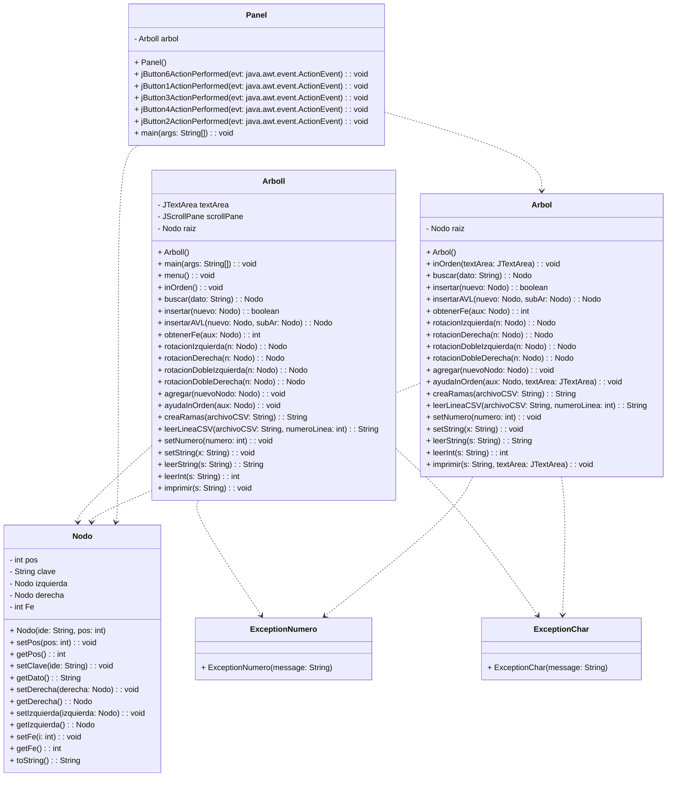

#Árbol Binario como índice

---
## Descripción

>El proyecto se centra en optimizar el manejo de información, abordando la eficiencia en la consulta de datos, la metodología empleada implica el uso de un árbol binario para la lecura de un archivo CSV y la consulta de la información contenida. Este enfoque optimizado permite recuperar la información de interés de manera efectiva y rápida, destacando la importancia de la estructura de datos en la eficiencia de la gestión de la información.

>Nombre del alumno 1: **DIEGO GARCIA JENNIFER**
>Nombre del alumno 2: **MARTINEZ MENDOZA JESUS ANGEL**
>Nombre del alumno 3: **VASQUEZ HERNANDEZ BERNARDO ADONAI**

>Carrera que cursan: **Ingeniería En Sistemas Computacionales**
>Nombre de la materia: **Estructura De Datos**
>Clave de la materia: **SCD1007**

Competencia de la materia: 
*Conoce, comprende y aplica los algoritmos de búsqueda para el uso adecuado en el desarrollo de aplicaciones que permita solucionar problemas del  entorno*.

Nombre del asesor: **SILVA MARTINEZ DALIA**

---

## UML

---
## API

### Nodo

#### Descripción
La clase `Nodo` representa un nodo de un árbol binario de búsqueda. Cada nodo contiene información sobre su posición, clave, altura, y referencias a sus nodos hijo izquierdo y derecho.

#### Campos
| Tipo | Campo | Descripción |
|------|-------|-------------|
| `int` | `pos` | Almacena la posición del nodo. |
| `String` | `clave` | Almacena la clave del nodo. |
| `int` | `altura` | Almacena la altura del nodo en el árbol. |
| `Nodo` | `izquierda` | Referencia al nodo hijo izquierdo. |
| `Nodo` | `derecha` | Referencia al nodo hijo derecho. |
| `int` | `Fe` | Factor de equilibrio del nodo. |

#### Constructores
| Constructor | Descripción |
|-------------|-------------|
| `Nodo(String ide, int pos)` | Crea un nuevo nodo con la clave y posición especificadas. |

#### Métodos
| Nombre | Tipo de Dato que Retorna | Tipo de dato que recibe | Descripción |
|--------|--------|-------------------------|-------------|
| `setPos(int pos)` | `void` | `int pos` | Establece la posición del nodo. |
| `getPos()` | `int` | - | Obtiene la posición del nodo. |
| `setClave(String ide)` | `void` | `String ide` | Establece la clave del nodo. |
| `getDato()` | `String` | - | Obtiene la clave del nodo. |
| `setDerecha(Nodo derecha)` | `void` | `Nodo derecha` | Establece el nodo hijo derecho. |
| `getDerecha()` | `Nodo` | - | Obtiene el nodo hijo derecho. |
| `setIzquierda(Nodo izquierda)` | `void` | `Nodo izquierda` | Establece el nodo hijo izquierdo. |
| `getIzquierda()` | `Nodo` | - | Obtiene el nodo hijo izquierdo. |
| `setFe(int i)` | `void` | `int i` | Establece el factor de equilibrio del nodo. |
| `getFe()` | `int` | - | Obtiene el factor de equilibrio del nodo. |
| `toString()` | `String` | - | Devuelve una representación en cadena del nodo. |
### Arbol
#### Descripción
La clase `Arbol` representa un árbol binario de búsqueda y contiene métodos para realizar operaciones como la búsqueda, inserción y recorrido inorden.

#### Campos
| Tipo | Campo | Descripción |
|------|-------|-------------|
| `Nodo` | `raiz` | Representa la raíz del árbol. |

#### Constructores
| Constructor | Descripción |
|-------------|-------------|
| `Arbol()` | Crea un nuevo árbol con raíz nula. |

#### Métodos
| Nombre | Tipo de Dato que Retorna | Tipo de dato que recibe | Descripción |
|--------|--------|-------------------------|-------------|
| `inOrden(JTextArea textArea)` | `void` | `JTextArea textArea` | Realiza un recorrido inorden en el árbol y muestra los resultados en un componente JTextArea. |
| `ayudaInOrden(Nodo aux, JTextArea textArea)` | `void` | `Nodo aux, JTextArea textArea` | Método auxiliar para realizar el recorrido inorden. |
| `buscar(String dato)` | `Nodo` | `String dato` | Busca un nodo con el dato especificado en el árbol. |
| `buscarRecursivo(Nodo nodo, String dato)` | `Nodo` | `Nodo nodo, String dato` | Método auxiliar para la búsqueda recursiva en el árbol. |
| `insertar(Nodo nuevo)` | `boolean` | `Nodo nuevo` | Inserta un nuevo nodo en el árbol. |
| `insertarAVL(Nodo nuevo, Nodo subAr)` | `Nodo` | `Nodo nuevo, Nodo subAr` | Método auxiliar para la inserción AVL en el árbol. |
| `obtenerFe(Nodo aux)` | `int` | `Nodo aux` | Obtiene el factor de equilibrio de un nodo. |
| `rotacionIzquierda(Nodo n)` | `Nodo` | `Nodo n` | Realiza una rotación simple a la izquierda en el árbol AVL. |
| `rotacionDerecha(Nodo n)` | `Nodo` | `Nodo n` | Realiza una rotación simple a la derecha en el árbol AVL. |
| `rotacionDobleIzquierda(Nodo n)` | `Nodo` | `Nodo n` | Realiza una rotación doble a la izquierda en el árbol AVL. |
| `rotacionDobleDerecha(Nodo n)` | `Nodo` | `Nodo n` | Realiza una rotación doble a la derecha en el árbol AVL. |
| `agregar(Nodo nuevoNodo)` | `void` | `Nodo nuevoNodo` | Agrega un nuevo nodo al árbol. |
| `agregarRecursivo(Nodo actual, Nodo nuevoNodo)` | `void` | `Nodo actual, Nodo nuevoNodo` | Método auxiliar para la inserción recursiva en el árbol. |
| `creaRamas(String archivoCSV)` | `String` | `String archivoCSV` | Crea nodos en el árbol a partir de un archivo CSV. |
| `leerLineaCSV(String archivoCSV, int numeroLinea)` | `String` | `String archivoCSV, int numeroLinea` | Lee una línea específica de un archivo CSV. |
| `setNumero(int numero)` | `void` | `int numero` | Establece restricciones para el número ingresado. |
| `setString(String x)` | `void` | `String x` | Establece restricciones para la cadena ingresada. |
| `leerString(String s)` | `String` | `String s` | Lee una cadena de texto, validando las restricciones. |
| `leerInt(String s)` | `int` | `String s` | Lee un número entero, validando las restricciones. |
| `leerCSV()` | `String` | - | Lee el contenido de un archivo CSV y devuelve una representación en cadena. |
| `imprimir(String s, JTextArea textArea)` | `void` | `String s, JTextArea textArea` | Muestra una cadena en un componente JTextArea. |

### Panel

#### Descripción
La clase `Panel` representa un marco de interfaz de usuario (JFrame) que actúa como un panel de control para interactuar con un árbol y realizar operaciones como buscar nodos, mostrar el árbol en orden, mostrar el contenido del CSV, y borrar el panel.

#### Campos
| Tipo | Campo | Descripción |
|------|-------|-------------|
| `Arbol` | `arbol` | Representa la instancia de la clase `Arbol` que contiene la lógica del árbol de búsqueda. |
| `javax.swing.JInternalFrame` | `jInternalFrame1` | Marco interno para organizar componentes visuales. |
| `javax.swing.JButton` | `jButton1` | Botón para realizar la búsqueda por clave. |
| `javax.swing.JButton` | `jButton2` | Botón para realizar la búsqueda por posición. |
| `javax.swing.JButton` | `jButton3` | Botón para mostrar el contenido del CSV. |
| `javax.swing.JButton` | `jButton4` | Botón para mostrar el árbol en orden. |
| `javax.swing.JButton` | `jButton6` | Botón para borrar el contenido del panel. |
| `javax.swing.JScrollPane` | `jScrollPane1` | Panel de desplazamiento para el área de texto. |
| `javax.swing.JTextArea` | `jTextArea1` | Área de texto para mostrar resultados y mensajes. |
| `javax.swing.JTextField` | `jTextField1` | Campo de texto para mostrar el título "MENU". |
| `javax.swing.JTextField` | `jTextField2` | Campo de texto para ingresar datos. |

#### Constructores
| Constructor | Descripción |
|-------------|-------------|
| `Panel()` | Inicializa la interfaz gráfica y el árbol, y carga datos desde el archivo CSV "Libro1.csv". |

#### Métodos
| Nombre | Tipo de Dato que Retorna | Tipo de dato que recibe | Descripción |
|--------|--------|-------------------------|-------------|
| `jButton6ActionPerformed(java.awt.event.ActionEvent evt)` | `void` | `java.awt.event.ActionEvent evt` | Borra el contenido del área de texto. |
| `jButton1ActionPerformed(java.awt.event.ActionEvent evt)` | `void` | `java.awt.event.ActionEvent evt` | Realiza la búsqueda por clave y muestra el resultado en el área de texto. |
| `jButton3ActionPerformed(java.awt.event.ActionEvent evt)` | `void` | `java.awt.event.ActionEvent evt` | Muestra el contenido del CSV en el área de texto. |
| `jButton4ActionPerformed(java.awt.event.ActionEvent evt)` | `void` | `java.awt.event.ActionEvent evt` | Muestra el árbol en orden en el área de texto. |
| `jButton2ActionPerformed(java.awt.event.ActionEvent evt)` | `void` | `java.awt.event.ActionEvent evt` | Realiza la búsqueda por posición y muestra el resultado en el área de texto. |
| `main(String args[])` | `void` | `String args[]` | Método principal que inicia la aplicación. |

### Arboll

#### Descripción
La clase `Arboll` representa un árbol binario de búsqueda (BST) con funcionalidades específicas. Proporciona métodos para buscar nodos, mostrar el árbol en orden, leer datos desde un archivo CSV, e interactuar con una interfaz gráfica de usuario.

#### Campos
| Tipo | Campo | Descripción |
|------|-------|-------------|
| `JTextArea` | `textArea` | Área de texto para mostrar resultados. |
| `JScrollPane` | `scrollPane` | Panel de desplazamiento para el área de texto. |
| `Nodo` | `raiz` | Nodo raíz del árbol binario de búsqueda. |

#### Constructores
| Constructor | Descripción |
|-------------|-------------|
| `Arboll()` | Inicializa el área de texto y el nodo raíz del árbol. |

#### Métodos
| Nombre | Tipo de Dato que Retorna | Tipo de dato que recibe | Descripción |
|--------|--------|-------------------------|-------------|
| `menu()` | `void` | Ninguno | Muestra un menú interactivo para realizar diversas operaciones en el árbol. |
| `inOrden()` | `void` | Ninguno | Realiza un recorrido en orden del árbol y muestra los nodos en el área de texto. |
| `ayudaInOrden(Nodo aux)` | `void` | `Nodo aux` | Método auxiliar para el recorrido en orden del árbol. |
| `buscar(String dato)` | `Nodo` | `String dato` | Busca un nodo con la clave especificada en el árbol. |
| `buscarRecursivo(Nodo nodo, String dato)` | `Nodo` | `Nodo nodo`, `String dato` | Método auxiliar para la búsqueda recursiva de nodos en el árbol. |
| `insertar(Nodo nuevo)` | `boolean` | `Nodo nuevo` | Inserta un nuevo nodo en el árbol. |
| `insertarAVL(Nodo nuevo, Nodo subAr)` | `Nodo` | `Nodo nuevo`, `Nodo subAr` | Método auxiliar para insertar nodos y mantener el equilibrio AVL del árbol. |
| `obtenerFe(Nodo aux)` | `int` | `Nodo aux` | Obtiene el factor de equilibrio (fe) de un nodo. |
| `rotacionIzquierda(Nodo n)` | `Nodo` | `Nodo n` | Realiza una rotación simple a la izquierda en el árbol. |
| `rotacionDerecha(Nodo n)` | `Nodo` | `Nodo n` | Realiza una rotación simple a la derecha en el árbol. |
| `rotacionDobleIzquierda(Nodo n)` | `Nodo` | `Nodo n` | Realiza una rotación doble (izquierda-derecha) en el árbol. |
| `rotacionDobleDerecha(Nodo n)` | `Nodo` | `Nodo n` | Realiza una rotación doble (derecha-izquierda) en el árbol. |
| `agregar(Nodo nuevoNodo)` | `void` | `Nodo nuevoNodo` | Agrega un nuevo nodo al árbol. |
| `agregarRecursivo(Nodo actual, Nodo nuevoNodo)` | `void` | `Nodo actual`, `Nodo nuevoNodo` | Método auxiliar para agregar nodos recursivamente al árbol. |
| `creaRamas(String archivoCSV)` | `String` | `String archivoCSV` | Lee datos desde un archivo CSV y crea nodos en el árbol. |
| `leerLineaCSV(String archivoCSV, int numeroLinea)` | `String` | `String archivoCSV`, `int numeroLinea` | Lee una línea específica desde un archivo CSV. |
| `setNumero(int numero)` | `void` | `int numero` | Establece restricciones para el número proporcionado. Lanza `ExceptionNumero` si el número es negativo o no es entero. |
| `setString(String x)` | `void` | `String x` | Establece restricciones para la cadena proporcionada. Lanza `ExceptionChar` si la cadena contiene caracteres que no son letras. |
| `leerString(String s)` | `String` | `String s` | Lee una cadena del usuario, aplicando validaciones. |
| `leerInt(String s)` | `int` | `String s` | Lee un número entero del usuario, aplicando validaciones. |
| `imprimir(String s)` | `void` | `String s` | Imprime una cadena en el área de texto. |

### ExceptionNumero

#### Descripción
La clase `ExceptionNumero` extiende la clase `Exception` en Java y se utiliza para representar excepciones relacionadas con restricciones numéricas.

#### Constructores
| Constructor | Descripción |
|-------------|-------------|
| `ExceptionNumero(String message)` | Crea una nueva instancia de `ExceptionNumero` con el mensaje de error especificado. |

#### Métodos
La clase `ExceptionNumero` hereda todos los métodos de la clase base `Exception` y no agrega métodos adicionales.

### ExceptionChar

#### Descripción
La clase `ExceptionChar` extiende la clase `Exception` en Java y se utiliza para representar excepciones relacionadas con restricciones de caracteres.

#### Constructores
| Constructor | Descripción |
|-------------|-------------|
| `ExceptionChar(String message)` | Crea una nueva instancia de `ExceptionChar` con el mensaje de error especificado. |

#### Métodos
La clase `ExceptionChar` hereda todos los métodos de la clase base `Exception` y no agrega métodos adicionales.
